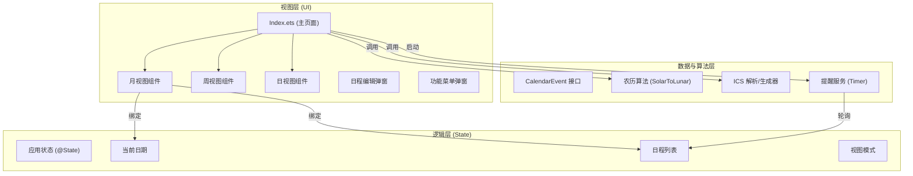

# HarmonyOS 智能日历 (HarmonyCalendar) 产品报告

## 1. 产品功能介绍

本项目是一款基于 HarmonyOS (ArkTS) 开发的智能日历应用，旨在为用户 provide 轻量、高效的时间管理体验。应用集成了基础的日历查看与日程管理功能，并扩展了农历显示、跨平台日程交换（ICS）及订阅功能。

### 1.1 核心功能
*   **多视图日历展示**：
    *   **月视图**：经典的网格布局，直观展示当月日期及农历信息，支持左右滑动切换月份。
    *   **周视图**：聚焦本周日程，以列表形式展示每天的安排，方便短期规划。
    *   **日视图**：详细展示当天的所有日程项，时间轴清晰。
*   **全方位日程管理**：
    *   支持**添加**、**编辑**、**查看**和**删除**日程事件。
    *   日程包含标题、描述、起止时间、全天标记等详细信息。
*   **智能提醒**：
    *   支持自定义提醒时间（如提前5分钟、15分钟、1小时等）。
    *   应用内实时弹窗提醒，确保不错过重要事项。

### 1.2 扩展功能
*   **农历支持**：
    *   内置 1900-2100 年农历算法，在日历视图中显示农历日期、节气及闰月信息。
*   **数据导入导出 (RFC 5545)**：
    *   **导出**：将本地日程导出为标准 `.ics` 格式文本，可被 Google Calendar、Outlook 等识别。
    *   **导入**：支持解析标准 `.ics` 文本，批量导入外部日程。
*   **网络订阅 (模拟)**：
    *   支持管理网络日历订阅源，演示了从 URL 获取并解析日程的流程。

---

## 2. 程序概要设计

### 2.1 交互设计
应用采用单页应用 (Single Page Application) 模式，通过顶部 Tab 栏快速切换视图。
*   **顶部导航栏**：包含“今天”快速跳转、月份切换器、更多菜单（导入/导出/订阅）。
*   **视图区域**：根据 `currentView` 状态动态渲染 `MonthView`、`WeekView` 或 `DayView`。
*   **悬浮操作**：通过底部或特定区域的交互触发“新建日程”弹窗。

### 2.2 数据模型设计
核心数据结构 `CalendarEvent` 定义如下：
```typescript
interface CalendarEvent {
  id: string;           // 唯一标识
  title: string;        // 标题
  description?: string; // 描述
  startTime: Date;      // 开始时间
  endTime: Date;        // 结束时间
  allDay: boolean;      // 是否全天
  source?: string;      // 来源 (local/imported/subscription)
  reminderMinutes?: number; // 提前提醒分钟数
  reminded?: boolean;   // 是否已提醒
}
```

### 2.3 逻辑流程
*   **视图渲染**：基于 `currentDate` 计算当前月/周的日期网格，结合 `events` 数组过滤出当天的事件进行渲染。
*   **提醒机制**：应用启动时开启 `setInterval` 定时器（10秒轮询），对比当前时间与事件提醒时间，触发弹窗。
*   **ICS 处理**：
    *   **生成**：遍历事件数组，拼接符合 RFC 5545 规范的字符串。
    *   **解析**：使用状态机模式逐行读取 ICS 文本，提取 `VEVENT` 块并转换为 `CalendarEvent` 对象。

---

## 3. 软件架构图

本项目采用 MVVM 模式的变体，利用 ArkTS 的声明式 UI 特性实现视图与数据的绑定。



---

## 4. 技术亮点及其实现原理

### 4.1 高精度农历算法实现
*   **原理**：采用查表法（Table Lookup）。内置了 1900 年至 2100 年的农历数据表（十六进制压缩存储），包含每年的大小月分布、闰月位置及闰月天数。
*   **实现**：通过 `solarToLunar` 函数，计算公历日期与基准日期（1900年1月31日）的天数差，通过查表逐年、逐月递减天数，最终确定农历年月日。支持处理复杂的闰月逻辑（如“闰六月”）。

### 4.2 标准 ICS 协议解析器
*   **原理**：遵循 RFC 5545 (iCalendar) 国际标准。
*   **实现**：
    *   **导出**：手动构建 `BEGIN:VCALENDAR` ... `END:VCALENDAR` 结构，将 JS `Date` 对象格式化为 `YYYYMMDDTHHmmSS` 格式。
    *   **导入**：实现了一个轻量级的文本解析器。通过 `split('\n')` 分割行，使用 `cursor` 指针遍历。当遇到 `BEGIN:VEVENT` 时进入事件解析模式，直到 `END:VEVENT` 结束，提取 `SUMMARY`, `DTSTART`, `DTEND` 等关键字段。

### 4.3 声明式 UI 与实时响应
*   **原理**：利用 HarmonyOS ArkTS 的 `@State` 和 `@Builder` 机制。
*   **实现**：
    *   日历视图并非静态绘制，而是基于数据驱动。例如月视图的 42 个格子（6行7列）是通过计算当前月第一天的偏移量动态生成的 `Date` 数组。
    *   当用户切换月份或点击“今天”时，只需修改 `currentDate` 状态变量，UI 会自动重新计算并刷新视图，无需手动操作 DOM 节点。

### 4.4 轮询式提醒服务
*   **原理**：在前端模拟后台服务。
*   **实现**：在 `aboutToAppear` 生命周期中启动定时器。每隔 10 秒遍历所有未提醒且设置了提醒时间的事件。
    *   算法：`if (now >= eventTime - reminderMinutes && now < eventTime)`。
    *   优化：触发提醒后立即更新事件的 `reminded` 状态，防止重复弹窗。
